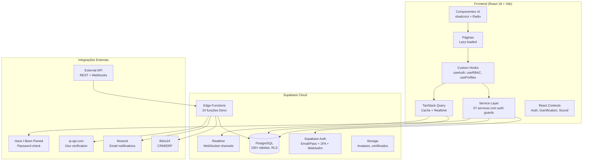
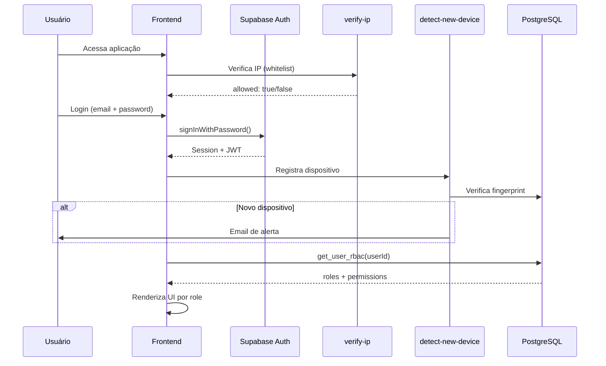
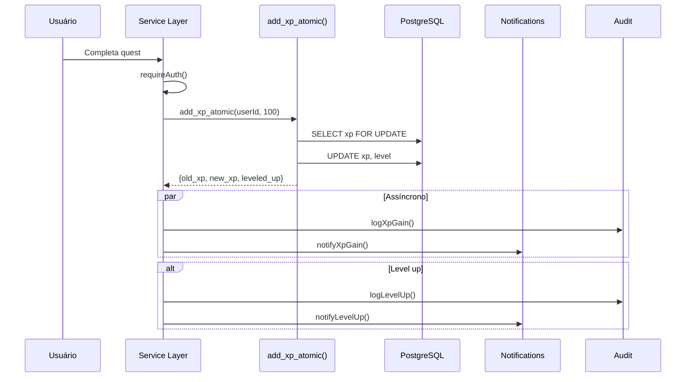
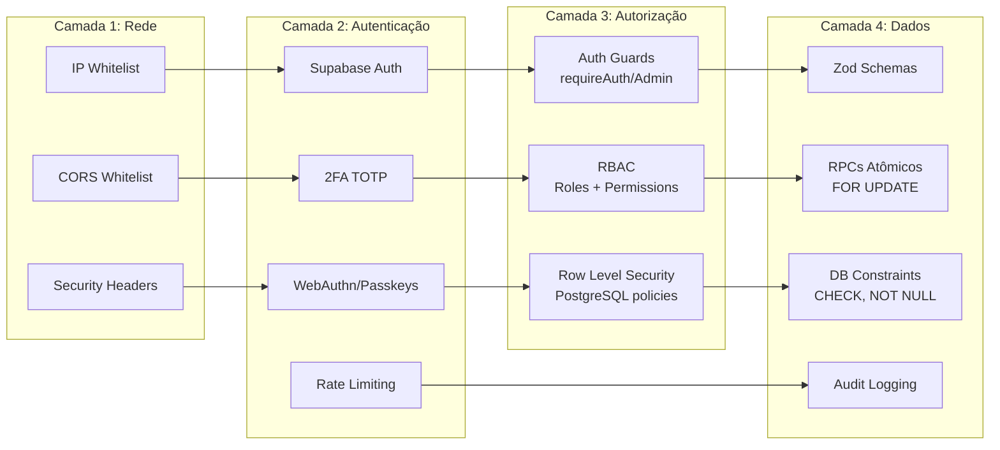

# Arquitetura do Sistema — GameficaRH

## Diagrama de Alto Nível

## Fluxo de Autenticação

## Fluxo de Gamificação (XP)

## Camadas de Segurança

## Decisões Arquiteturais (ADR)

### ADR-001: Supabase como BaaS
- **Contexto**: Necessidade de backend rápido com auth, DB, realtime
- **Decisão**: Supabase (PostgreSQL + Auth + Edge Functions)
- **Consequência**: Lock-in parcial, mas RLS + PostgREST eliminam necessidade de API custom

### ADR-002: RPCs Atômicos para Gamificação
- **Contexto**: Race conditions em addXp, addCoins com padrão read-modify-write
- **Decisão**: Funções PostgreSQL com `SELECT ... FOR UPDATE` + `SECURITY DEFINER`
- **Consequência**: Operações atômicas no nível do banco, fallback em JS se RPC indisponível

### ADR-003: Auth Guards na Service Layer
- **Contexto**: RLS protege no nível DB, mas services não verificavam caller
- **Decisão**: `requireAuth()`, `requireSelfOrAdmin()`, `requireAdminOrManager()` em todas mutations
- **Consequência**: Dupla camada de proteção (service + DB)

### ADR-004: sessionStorage em vez de localStorage
- **Contexto**: Tokens JWT em localStorage vulneráveis a XSS
- **Decisão**: Migrar para sessionStorage (limpa ao fechar aba)
- **Consequência**: Usuário precisa re-autenticar ao abrir nova aba

### ADR-005: CORS Whitelist Compartilhado
- **Contexto**: 24 Edge Functions com CORS `'*'` hardcoded
- **Decisão**: Módulo compartilhado `_shared/cors.ts` com whitelist de origens
- **Consequência**: Segurança consistente, fácil de atualizar
