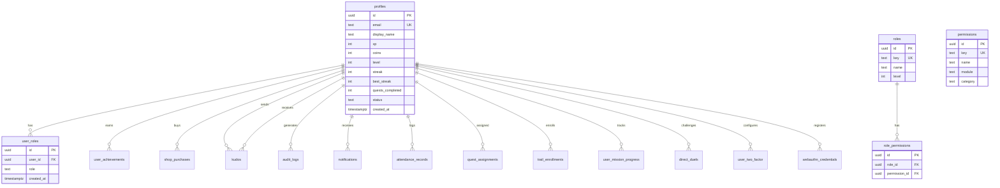
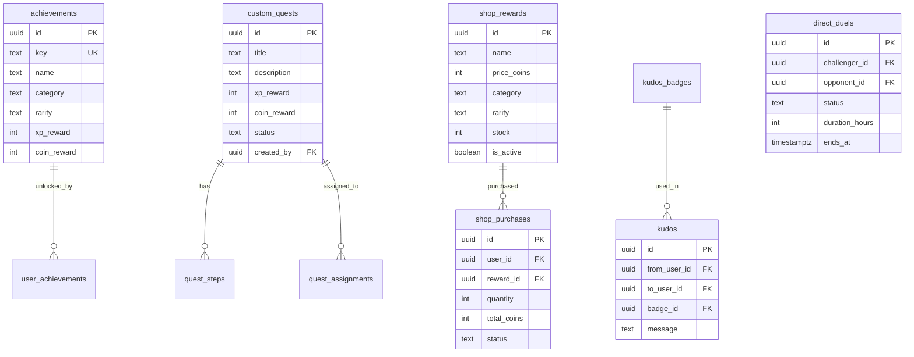
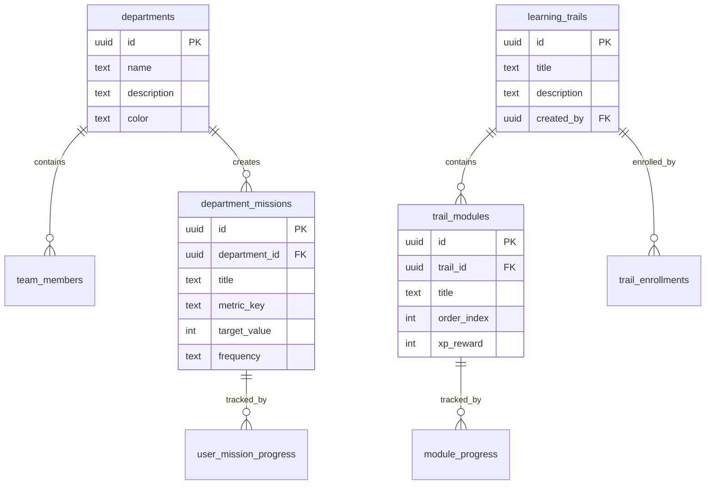
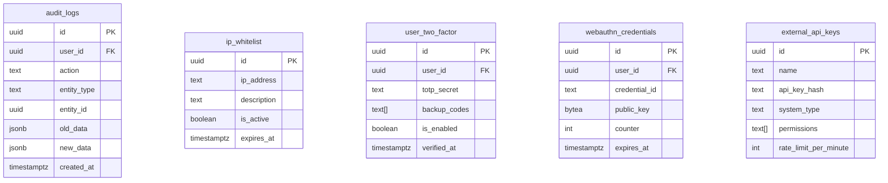

# Diagrama ER — GameficaRH

## Core (Usuários e Gamificação)

```mermaid
erDiagram
    profiles ||--o{ user_roles : has
    profiles ||--o{ user_achievements : earns
    profiles ||--o{ shop_purchases : buys
    profiles ||--o{ kudos : sends
    profiles ||--o{ kudos : receives
    profiles ||--o{ audit_logs : generates
    profiles ||--o{ notifications : receives
    profiles ||--o{ attendance_records : logs
    profiles ||--o{ quest_assignments : assigned
    profiles ||--o{ trail_enrollments : enrolls
    profiles ||--o{ user_mission_progress : tracks
    profiles ||--o{ direct_duels : challenges
    profiles ||--o{ user_two_factor : configures
    profiles ||--o{ webauthn_credentials : registers

    profiles {
        uuid id PK
        text email UK
        text display_name
        int xp
        int coins
        int level
        int streak
        int best_streak
        int quests_completed
        text status
        timestamptz created_at
    }

    user_roles {
        uuid id PK
        uuid user_id FK
        text role
        timestamptz created_at
    }

    roles ||--o{ role_permissions : has
    roles {
        uuid id PK
        text key UK
        text name
        int level
    }

    permissions {
        uuid id PK
        text key UK
        text name
        text module
        text category
    }

    role_permissions {
        uuid id PK
        uuid role_id FK
        uuid permission_id FK
    }
```

## Gamificação

```mermaid
erDiagram
    achievements ||--o{ user_achievements : unlocked_by
    achievements {
        uuid id PK
        text key UK
        text name
        text category
        text rarity
        int xp_reward
        int coin_reward
    }

    custom_quests ||--o{ quest_steps : has
    custom_quests ||--o{ quest_assignments : assigned_to
    custom_quests {
        uuid id PK
        text title
        text description
        int xp_reward
        int coin_reward
        text status
        uuid created_by FK
    }

    shop_rewards ||--o{ shop_purchases : purchased
    shop_rewards {
        uuid id PK
        text name
        int price_coins
        text category
        text rarity
        int stock
        boolean is_active
    }

    shop_purchases {
        uuid id PK
        uuid user_id FK
        uuid reward_id FK
        int quantity
        int total_coins
        text status
    }

    kudos_badges ||--o{ kudos : used_in
    kudos {
        uuid id PK
        uuid from_user_id FK
        uuid to_user_id FK
        uuid badge_id FK
        text message
    }

    direct_duels {
        uuid id PK
        uuid challenger_id FK
        uuid opponent_id FK
        text status
        int duration_hours
        timestamptz ends_at
    }
```

## Organização

```mermaid
erDiagram
    departments ||--o{ team_members : contains
    departments ||--o{ department_missions : creates
    departments {
        uuid id PK
        text name
        text description
        text color
    }

    department_missions ||--o{ user_mission_progress : tracked_by
    department_missions {
        uuid id PK
        uuid department_id FK
        text title
        text metric_key
        int target_value
        text frequency
    }

    learning_trails ||--o{ trail_modules : contains
    learning_trails ||--o{ trail_enrollments : enrolled_by
    learning_trails {
        uuid id PK
        text title
        text description
        uuid created_by FK
    }

    trail_modules ||--o{ module_progress : tracked_by
    trail_modules {
        uuid id PK
        uuid trail_id FK
        text title
        int order_index
        int xp_reward
    }
```

## Segurança e Auditoria

```mermaid
erDiagram
    audit_logs {
        uuid id PK
        uuid user_id FK
        text action
        text entity_type
        uuid entity_id
        jsonb old_data
        jsonb new_data
        timestamptz created_at
    }

    ip_whitelist {
        uuid id PK
        text ip_address
        text description
        boolean is_active
        timestamptz expires_at
    }

    user_two_factor {
        uuid id PK
        uuid user_id FK
        text totp_secret
        text[] backup_codes
        boolean is_enabled
        timestamptz verified_at
    }

    webauthn_credentials {
        uuid id PK
        uuid user_id FK
        text credential_id
        bytea public_key
        int counter
        timestamptz expires_at
    }

    external_api_keys {
        uuid id PK
        text name
        text api_key_hash
        text system_type
        text[] permissions
        int rate_limit_per_minute
    }
```
